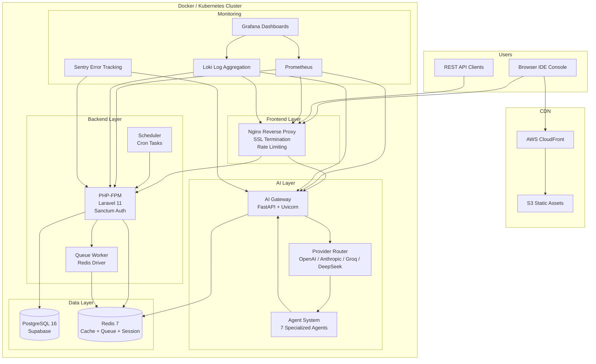

# Corex Opensource Platform ( Lovable Corsor ) PR5

<p align="center">
  
  
  
  <br>
  
  
  
  
  
</p>

**Corex.dev** is an AI-powered development platform that integrates a multi-agent AI system with a full-featured IDE console. It provides code generation, debugging, review, testing, and documentation assistance through a conversational AI interface — all within a browser-based development environment.

> 🚧 **Status:** Active development. Core functionality is implemented and operational. See [CONTRIBUTING](#contributing) to get involved.

---

## Architecture



### Request Flow

```
User → Nginx (SSL termination, rate limiting, static assets)
  ├── /api/*       → PHP-FPM (Laravel → PostgreSQL + Redis)
  ├── /v1/ai/*     → AI Gateway (FastAPI → Provider Router → Agents)
  ├── /ws/*        → WebSocket (Laravel Reverb)
  └── /*           → Static assets (Blade views, JS, CSS)
```

---

## Technology Stack

| Layer | Technology | Purpose |
|-------|-----------|---------|
| **Backend** | Laravel 11 / PHP 8.3 | REST API, auth, business logic, Blade views |
| **AI Gateway** | Python 3.12 / FastAPI 0.111 | Multi-provider AI routing, agent orchestration |
| **Database** | PostgreSQL 16 | Primary data store (UUID PKs, jsonb, timestampsTz) |
| **Cache & Queue** | Redis 7 (Alpine) | Session store, cache, queue driver, rate limits |
| **Reverse Proxy** | Nginx 1.27 (Alpine) | SSL termination, HTTP/2, rate limiting, static serving |
| **AI Providers** | OpenAI, Anthropic, Groq, DeepSeek | Code generation, chat completions, embeddings |
| **Monitoring** | Prometheus + Grafana + Loki | Metrics, dashboards, log aggregation |
| **Error Tracking** | Sentry | PHP + Python + JS error reporting |
| **Containerization** | Docker + Docker Compose | Local development, multi-stage builds |
| **Orchestration** | Kubernetes + Terraform | Production deployment (EKS) |
| **CI/CD** | GitHub Actions | Lint, test, build, deploy, security scanning |

---

## Prerequisites

```bash
# Local development
php 8.3+ (with pdo_pgsql, mbstring, bcmath, redis, xml)
python 3.12+
composer 2.x
docker & docker compose (v2)
node 22+ (for frontend assets)

# Infrastructure
aws-cli (for EKS/ECR)
terraform 1.7+ (for IaC)
kubectl 1.29+ (for K8s management)
helm 3.14+ (for monitoring charts)

# Recommended
gh (GitHub CLI)
just or make (command runner)
```

---

## Installation

```bash
# 1. Clone the repository
git clone https://github.com/corex-dev/corex.git
cd corex

# 2. Backend setup
cp .env.example backend/.env
cd backend
composer install
php artisan key:generate
cd ..

# 3. AI Gateway setup
cd ai-gateway
python -m venv .venv
source .venv/bin/activate
pip install -r requirements.txt
cd ..

# 4. Frontend (if working on landing page)
cd backend
npm install
npm run build
cd ..
```

---

## Configuration

### Environment Variables

Copy `.env.example` to `backend/.env` and configure:

```bash
# Application
APP_NAME=Corex
APP_ENV=local
APP_KEY=base64:...        # Generated by php artisan key:generate
APP_URL=http://localhost:8000

# Database
DB_CONNECTION=pgsql
DB_HOST=localhost
DB_PORT=5432
DB_DATABASE=corex
DB_USERNAME=postgres
DB_PASSWORD=secret

# Redis
REDIS_HOST=localhost
REDIS_PORT=6379
REDIS_PASSWORD=

# AI Provider Keys
OPENAI_API_KEY=sk-...
ANTHROPIC_API_KEY=sk-ant-...
GROQ_API_KEY=gsk-...
DEEPSEEK_API_KEY=sk-...

# JWT (inter-service auth)
JWT_SECRET=your-secret
JWT_ALGORITHM=HS256

# Sentry
SENTRY_LARAVEL_DSN=https://...
SENTRY_DSN=https://...
SENTRY_FRONTEND_DSN=https://...

# AI Gateway
AI_GATEWAY_URL=http://localhost:8000
AI_GATEWAY_API_KEY=...
```

### Key Configuration Files

| File | Purpose |
|------|---------|
| `backend/.env` | Laravel environment configuration |
| `ai-gateway/.env` | Python service settings |
| `docker-compose.yml` | Local service orchestration |
| `docker/nginx/conf.d/default.conf` | Nginx virtual hosts |
| `docker/nginx/nginx.conf` | Nginx global config (SSL, security, caching) |
| `docker/nginx/certbot/cli.ini` | Let's Encrypt configuration |
| `infra/monitoring/prometheus/prometheus.yml` | Metrics collection |
| `infra/monitoring/loki/loki-config.yaml` | Log aggregation |
| `infra/k8s/` | Kubernetes manifests |

---

## Running Locally

### Full Stack (Docker Compose)

```bash
# Start all services
docker compose up -d

# View logs
docker compose logs -f

# Services:
# - Nginx:       http://localhost:8080
# - AI Gateway:  http://localhost:8000
# - PostgreSQL:  localhost:5432
# - Redis:       localhost:6379

# Run migrations
docker compose exec php php artisan migrate --seed

# Generate APP_KEY if missing
docker compose exec php php artisan key:generate
```

### Individual Services

```bash
# Backend only (with external DB/Redis)
cd backend
php artisan serve --host=0.0.0.0 --port=8001

# AI Gateway only
cd ai-gateway
uvicorn main:app --reload --host 0.0.0.0 --port 8000

# Monitoring stack
docker compose -f infra/monitoring/docker-compose.monitoring.yml up -d
# Grafana at http://localhost:3001 (admin/changeme)
# Prometheus at http://localhost:9090
# Loki at http://localhost:3100
```

### Monitoring Stack

```bash
# Start monitoring services
docker compose -f infra/monitoring/docker-compose.monitoring.yml up -d

# Access Grafana dashboards at http://localhost:3001
# Pre-configured dashboards:
#   - System Metrics (CPU, memory, disk, network, uptime)
#   - Application Performance (latency p95/p99, error rates, cache)
#   - AI Usage & Costs (cost by provider, tokens, budget alerts)
#   - User Activity (DAU/MAU, registrations, retention cohort)
#   - Error Rates & Logs (Loki log stream, alert list)
#   - Business Metrics (MRR, ARPU, churn, conversion rate)
```

---

## Testing

```bash
# Backend (PHPUnit 11)
cd backend
composer run test                          # Run all tests
php artisan test --filter=UserServiceTest  # Run specific test
vendor/bin/phpunit --coverage-html tests/coverage  # Coverage report

# AI Gateway (pytest)
cd ai-gateway
pytest --asyncio-mode=auto -v                          # Run all tests
pytest --cov=app --cov-report=html tests/              # Coverage report
pytest tests/test_routes.py -v                         # Specific test file
pytest -k "test_health"                                # Filter by name

# Linting
cd backend && composer run format          # Laravel Pint
cd ai-gateway && black --check app/        # Python formatting
cd ai-gateway && ruff check app/           # Python linting
cd ai-gateway && mypy app/                 # Type checking
```

### Test Requirements

| Service | Framework | Min Coverage | Mock Strategy |
|---------|-----------|-------------|---------------|
| Backend | PHPUnit 11 | ≥80% | `Http::fake()`, `DatabaseTransactions` |
| AI Gateway | pytest + pytest-asyncio | ≥80% | `httpx.MockTransport`, `AsyncClient` |
| Frontend | Vitest | ≥70% | `vi.mock()`, testing-library |

---

## Deployment

### Environments

| Environment | Domain | CI/CD | Infrastructure |
|-------------|--------|-------|---------------|
| `develop` → **staging** | `staging.corex.dev` | Auto on push | EKS `corex-staging` |
| `main` → **production** | `corex.dev` | Manual approval | EKS `corex-production` |

### CI/CD Pipelines (`.github/workflows/`)

| Workflow | Jobs | Trigger |
|----------|------|---------|
| `backend.yml` | lint → test (PG+Redis) → security scan → Docker build → deploy staging/production | Push to `main`/`develop`, PR |
| `ai-gateway.yml` | lint (black/flake8/mypy) → pytest → Docker build → deploy (blue-green) | Push to `main`/`develop`, PR |
| `frontend.yml` | ESLint → build → S3 sync → CloudFront invalidation | Push to `main`/`develop` |
| `security.yml` | CodeQL + Trivy + Gitleaks + Composer/pip audit + Checkov | Weekly + on push |

### Docker Build

```bash
# Backend (multi-stage)
docker build -f docker/php/Dockerfile --target app -t corex-backend .
docker build -f docker/php/Dockerfile --target worker -t corex-worker .

# AI Gateway (multi-stage)
docker build -f ai-gateway/Dockerfile -t corex-ai-gateway .

# Nginx
docker build -f docker/nginx/Dockerfile -t corex-nginx .
```

### Kubernetes Deployment

```bash
# Apply all manifests
kubectl apply -f infra/k8s/namespace.yaml
kubectl apply -f infra/k8s/configmap.yaml
kubectl apply -f infra/k8s/secrets.yaml
kubectl apply -f infra/k8s/deployments/
kubectl apply -f infra/k8s/services/
kubectl apply -f infra/k8s/ingress.yaml
kubectl apply -f infra/k8s/hpa.yaml
kubectl apply -f infra/k8s/pvc.yaml

# Monitor rollout
kubectl rollout status deployment/corex-backend -n corex
kubectl rollout status deployment/corex-ai-gateway -n corex
```

### SSL Certificates

```bash
# Issue Let's Encrypt certificates (staging test first)
./scripts/ssl-renew.sh issue

# Check expiry
./scripts/ssl-renew.sh check

# Force renewal
./scripts/ssl-renew.sh force

# Daily auto-renewal cron
./scripts/ssl-renew.sh setup-cron
```

### Terraform (Infrastructure as Code)

```bash
cd infra/terraform
terraform init -backend-config="key=corex/terraform.tfstate"
terraform workspace new staging || terraform workspace select staging
terraform plan -var-file=environments/staging.tfvars
terraform apply -var-file=environments/staging.tfvars
```

---

## Project Structure

```
corex/
├── .github/workflows/        # CI/CD pipelines (4 workflows)
│   ├── backend.yml           # PHP lint, test, Docker, deploy
│   ├── ai-gateway.yml        # Python lint, test, Docker, deploy
│   ├── frontend.yml          # ESLint, build, CDN deploy
│   └── security.yml          # CodeQL, Trivy, Gitleaks, audits
│
├── backend/                  # Laravel 11 Application
│   ├── app/
│   │   ├── Http/Controllers/ # API controllers
│   │   ├── Http/Middleware/  # SentryContext, auth middleware
│   │   ├── Http/Requests/    # Form request validation
│   │   ├── Http/Resources/   # API resource transformers
│   │   ├── Models/           # 8 Eloquent models (User, Project, etc.)
│   │   ├── Providers/        # Service providers
│   │   ├── Services/         # Business logic (Auth, Project, AI, Payment)
│   │   └── Traits/           # Reusable model traits
│   ├── config/               # Laravel config files
│   ├── database/
│   │   ├── factories/        # 8 model factories
│   │   ├── migrations/       # 8 migrations (UUID PKs, jsonb, timestampsTz)
│   │   └── seeders/          # Database seeder
│   ├── resources/
│   │   ├── js/               # Frontend JS (Sentry, console)
│   │   └── views/            # 19 Blade views (landing + console IDE)
│   ├── routes/               # API and web routes
│   └── tests/                # PHPUnit tests
│
├── ai-gateway/               # Python FastAPI Service
│   ├── app/
│   │   ├── api/              # Route definitions
│   │   ├── core/             # Config, security, exceptions, health, sentry
│   │   ├── models/           # Pydantic request/response schemas
│   │   ├── services/
│   │   │   ├── agents/       # 7 agents + orchestrator + workflows (11 files)
│   │   │   ├── providers/    # OpenAI, Anthropic, Groq, DeepSeek + base
│   │   │   └── ...           # Cache, rate limiter, usage tracker, router
│   │   └── utils/            # Logger, metrics, helpers
│   ├── tests/                # Pytest tests
│   ├── main.py               # FastAPI entry point
│   └── Dockerfile            # Multi-stage build
│
├── docker/                   # Container definitions
│   ├── nginx/                # Dockerfile, configs, certbot setup
│   └── php/                  # Dockerfile, PHP configs
│
├── infra/                    # Infrastructure as Code
│   ├── k8s/                  # 14 Kubernetes manifests
│   ├── terraform/            # 24 Terraform files (VPC, RDS, Redis, ECR, monitoring)
│   └── monitoring/           # Prometheus, Grafana, Loki, Tempo configs
│
├── scripts/                  # Utility scripts (SSL renewal, etc.)
├── docker-compose.yml        # 8-service local development stack
├── .env.example              # Environment variable template
├── AGENTS.md                 # AI agent development guidelines
└── README.md                 # This file
```

---

## Contributing

### Branch Naming

| Prefix | Purpose | Branch From |
|--------|---------|-------------|
| `feat/*` | New features | `develop` |
| `fix/*` | Bug fixes | `develop` (or `main` for hotfixes) |
| `chore/*` | Tooling, deps, config | `develop` |
| `docs/*` | Documentation only | `develop` |

### Commit Convention

```
type(scope): brief description

Optional body. Use imperative mood.
```

Types: `feat`, `fix`, `chore`, `docs`, `style`, `refactor`, `perf`, `test`, `ci`

### Pull Request Process

1. Branch off `develop`, PR back to `develop`
2. Title must follow commit convention
3. Describe what, why, how, testing steps
4. Add labels (`backend`, `ai-gateway`, `infra`, `ci`, `breaking`)
5. Request review from relevant team
6. Ensure all CI checks pass before merge
7. Squash-merge to `develop`, then fast-forward `main` for releases

### Code Standards

All code must follow the conventions detailed in [AGENTS.md](./AGENTS.md):

- **PHP**: PSR-12, strict types, PHPStan level max, constructor injection
- **Python**: PEP 8, Black 100-char, mypy strict, structlog
- **JS**: ES modules, `const`/`let`, async/await, optional chaining
- **Security**: No secrets, parameterized queries, input validation, rate limits
- **Migration**: Idempotent, UUID PKs, `foreignUuid()`, `timestampsTz()`, `softDeletes()`

---

## License

Proprietary. All rights reserved. Corex.dev is not open source software; the source code is made available for reference and contribution purposes only.

---

## Contact & Support

| Channel | Purpose |
|---------|---------|
| [GitHub Issues](https://github.com/corex-dev/corex/issues) | Bug reports, feature requests |
| [Discussions](https://github.com/corex-dev/corex/discussions) | Questions, ideas, community |
| Email: `menmengleapx1@gmail.com` | Security disclosures, partnerships |

---

## Acknowledgments

- [Laravel](https://laravel.com) — PHP framework
- [FastAPI](https://fastapi.tiangolo.com) — Python async framework
- [Prometheus](https://prometheus.io) — Metrics collection
- [Grafana](https://grafana.com) — Dashboard visualization
- [Loki](https://grafana.com/oss/loki/) — Log aggregation
- [Sentry](https://sentry.io) — Error tracking
- [Let's Encrypt](https://letsencrypt.org) — SSL certificates
